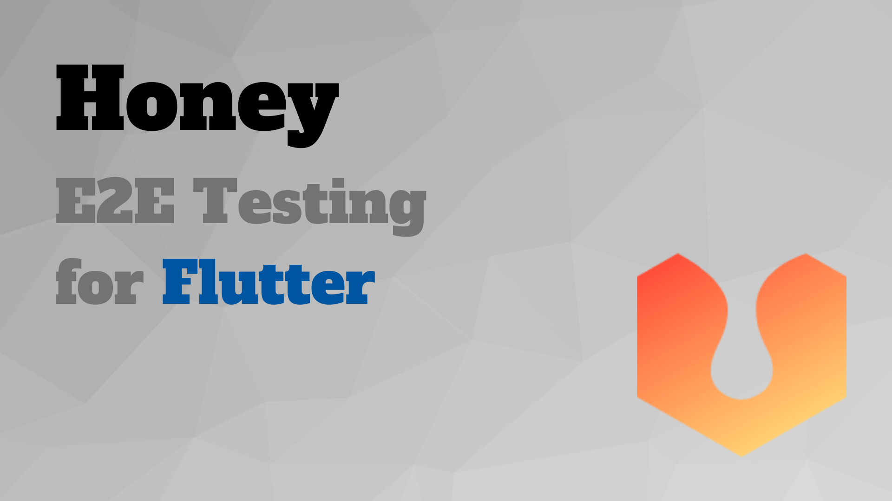
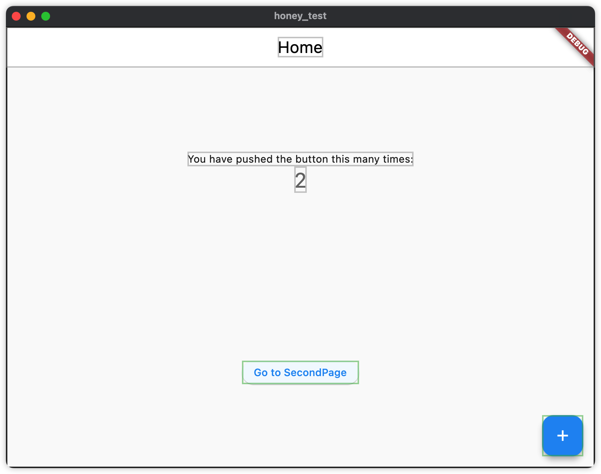
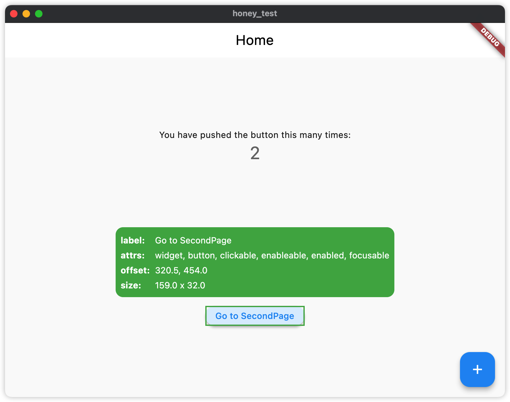

# honey-test-example

Honey e2e testing is an awesome package. After I tried it for a while, I feel it was so easy and helpful for developers, and even not programmers. Just use common sentences and complete them.  Now I will keep following Honey and expect the improvement of new versions.

## Article
[了解剛出爐的 Honey E2E Testing，不是開發者也能幫忙寫 Flutter 測試！](https://medium.com/flutter-formosa/了解剛出爐的-honey-e2e-testing-不是開發者也能幫忙寫-flutter-測試-5ab41d6e4634)

## Demo

## Weakness
- Common operations do not have enough keywords for testing, like scrolling.

## Contribute
- You can star and share with other developers if you feel good and learn something from this repository.
- If you have some ideas, please discuss them with me or commit PR.

## More of me

## Donate and encourage me
[![BuyMeACoffee][buy_me_a_coffee_badge]][buy_me_a_coffee]

<!-- Links -->
[buy_me_a_coffee]: https://www.buymeacoffee.com/yiichenhi
[buy_me_a_coffee_badge]: https://img.buymeacoffee.com/button-api/?text=Sponsor&emoji=&slug=yiichenhi&button_colour=FFDD00&font_colour=000000&font_family=Cookie&outline_colour=000000&coffee_colour=ffffff&size=64
